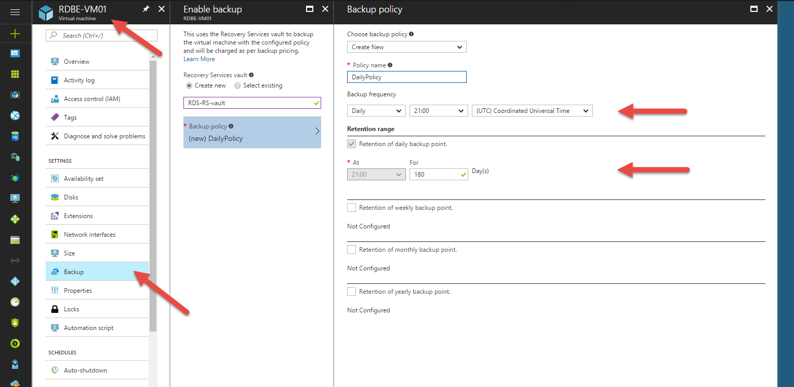

**Backup and Recovery Strategy**

When our RDS environment is deployed is recommendable to define a strategy for backup and recovery to be ready for a possible data loss.

In this type of environments, with a complex architecture, is necessary to consider all the elements that compose it and the key features and critical points of each of them.

In this short guide, we will take a quick look of the generic backup and recovery strategy for Azure VMs, and then, we will see in detail the considerations that we must consider for some of the elements of the architecture.

**Generic strategy for Backup and Recovery of Virtual Machines**

The RDS environment we are implementing in this repo is mainly composed of Virtual Machines (VM) with assigned RDS roles. So, to define a strategy for backup and restore generic VMs is essential.

**Backups**

[https://docs.microsoft.com/en-us/azure/backup/backup-azure-arm-vms](https://docs.microsoft.com/en-us/azure/backup/backup-azure-arm-vms)

In Azure Resources Manager, we can use Recovery Services vault to backup all our Virtual Machines. To activate the creation of backups we must enter on the Azure Portal and select the target VM.

On backup tab, we create a Recovery Services vault as can you see in the image bellow.

Is necessary to define a backup policy, selecting a schedule and frequency, and the retention of the data. There is a default retention period, but we can enlarge this period if we want. It has an impact on the costs.

When we create and activate the backups, we can see all the information of this service on the Recovery Services Vault section in Azure Portal as you can see in the image bellow.

The most important parts of this section are:

- Jobs: Here we can check the history that will be generated when the backups task are executed.
- Alerts and Events: Here are the notifications of the service. Is a nice place to be informed of the services status and backups task issues.
- Backups Items: Here we can check the VMs includes in this vault and access individually to each of them.

**Recovery**

[https://docs.microsoft.com/en-us/azure/backup/backup-azure-arm-restore-vms](https://docs.microsoft.com/en-us/azure/backup/backup-azure-arm-restore-vms)

**Domain Controllers**

[https://docs.microsoft.com/en-us/azure/backup/backup-azure-arm-restore-vms#restoring-domain-controller-vms](https://docs.microsoft.com/en-us/azure/backup/backup-azure-arm-restore-vms#restoring-domain-controller-vms)

The recovery of Active Directory Domain Controllers on Virtual Machines is a supported scenario in Azure Backup. Active Directory Restore Mode (necessary for some cases) is also available in Azure, so, all the Active Directory recovery scenarios are viable.

However, is necessary to be aware of some considerations depending of the type of structure of the Domain: one Domain on one Domain Controller, one Domain on some Domain Contollers, or some Domains in a forest.

In this case, the second case is our structure: one Domain on some DCs (2 by default) and both can be reached over the same network.

**Last DC in the forest**

If we are trying to recovery a DC which is the last in the forest, is recommendable to do a forest recovery.

**In other case**

If we are trying to recovery a DC which is not the last in the forest, we can restore it as any VM.

**SQL Database**

[https://docs.microsoft.com/en-us/azure/sql-database/sql-database-automated-backups](https://docs.microsoft.com/en-us/azure/sql-database/sql-database-automated-backups)

**Backups**

Azure SQL Database Service automatically creates a database backups and at no additional charge.

Depending of the tier of the database the retention period is from 7 days to 35 days. It is possible to enlarge this period configuring the long-term retention policy. In this case, there is an additional cost associated.

**Restore**

Now, let see how to use one of the automatically created restore points to restore a SQL Database.

In Azure Portal, select your database and go to the Overview tab. In the top menu, you can see a &quot;Restore&quot; button. Click on it.

Well, in this window you can select the restore point that you want use to recover your database status.

And it is all. Wait few minutes and your database status will be restored.
